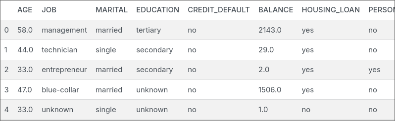
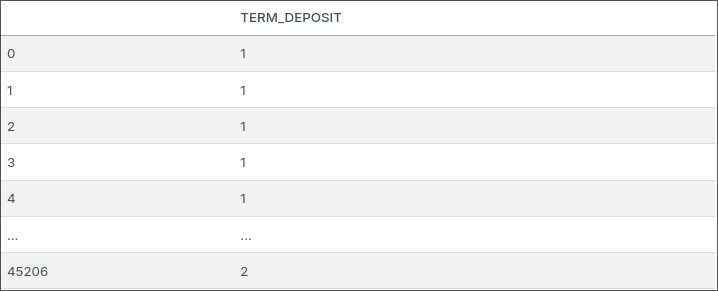
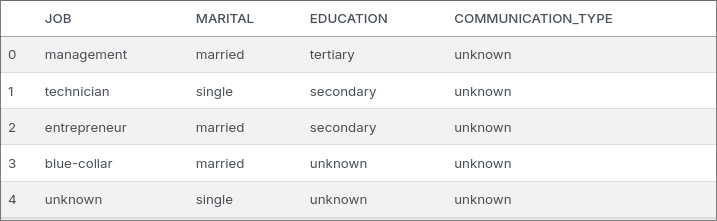

This project is created with the intention of fulfiling my curiosity. Some of the questions that I hope that I can answer by doing this project is:

1. What *type* of person is interested in subscribing to a term deposit?
2. With the assumption of using just calls to tell them about term deposit, is the action of just calling enough to persuade them? If it is enough what is the minimum time needed to know we have somewhat persuaded the person?
3. Between Logistic Regression and Support Machine Vector, which one is better?

The dataset that I am gona use is from a Portuguese banking institution marketing campaign. The goal of this dataset is to classify if the client will subscribe a term deposit. The original format of this file is `.arff` format which is suitable for machine learning and easier for machines to read.

To keep things simple I'm going to use only Logistic Regression and Support Machine Vector, another reason why I'm using only these models is to learn the workings of both models. At the end I'm going to compare its accuracy, to determine which is better. The results of this comparison is quite surprising.

## Cleaning Data

Taking a quick look at the data it's header are named using variables names, `V1, V2,...` because of this I first changed its headers to its associated description.

*Before Transformation*


*After Transformation*


After that I changed the `last_contact_day` and `last_contact_month` to become one column calling it `last_contact_date`. The reason for this change is because I found it a bit weird as to why it isn't combined to a single day. Additionally I added a line of code to change datetime to ordinal, to fit with the linear regression model.

*Before Transformation*


*After Transformation*


Then I changed the target `Y` which is the `term_deposit` column, for some odd reason its in 1 and 2. Which I personally found weird and didn't like it, so I applied `OrdinalEncoder` to become 0 and 1.

*Before Transformation*


*After Transformation*


Finally, some columns are categorical. I have thought of just using `OrdinalEncoder` but that will lead to the interpretation that it has a hierarchy, when there isn't. So I use `OneHotEncoder` class which transforms the these columns into a 1-column matrix, where each column is either `0` or `1`, where `0` mean "it doesn't belong to his category" while `1` is the opposite. In this matrix there can only be one `1` value.

*Before Transformation*


*After Transformation*


Note: After dealing with the categorical data, there were some other small changes to the dataframe which was converting floating data types to integer and re-indexing `term_deposit` to be the last column instead of the middle (this is due to transformations). 

## Explaratory Data Analysis

Before creating and evaluating models, I would like to see how the data is there any correlation with the feautures with the target, and see if any has a significant effect on it.


From the correlation matrix above ([original image](https://github.com/Just1a2Noob/Independent_Projects/blob/main/bank%20marketing/bank-marketing.ipynb)) we can see only a few features actually has a correlation with our target (`term_deposit`).

Next, I'm checking if the dataset is skewed or normally distributed. To do this I use boxplots on numerical data, not data that has been converted to date or binary.


From the boxplots above we can see that the dataset is somewhat skewed. Meaning this dataset **isn't normally distributed**.

## Model Training

### Logistic Regression

When creating the logistic regression model, I used scikit-learn's `LogisticRegression` class and for evaluating the both models I used both `accuracy_score` and `roc_auc_score`. Additionally the `penalty` parameter is set to `l1` due to the dataset being skewed and being wary of outliers.

```python
param_distributions = {
    'penalty': ['l1'],
    'tol': [1e-3, 1e-4],
    'C': loguniform(0.01, 100),
    'solver': ['liblinear', 'saga'],
    'max_iter': [1000, 2000, 5000] 
}
```


When splitting the data, I use the `StratefiedKFold` class to split the data. The reason for using `StratefiedKFold` is make the evaluation more robust and the computational load isn't big. 

```python
skf = StratifiedKFold(n_splits=5, shuffle=True, random_state=42)

fold = 0
aucs = []
accuracies = []

# Loop through the splits generated by StratifiedKFold
for train_index, test_index in skf.split(features, target):
    X_train, X_test = features.iloc[train_index], features.iloc[test_index]
    y_train, y_test = target.iloc[train_index], target.iloc[test_index]
    
    # Create a copy of the best model (to maintain independence between folds)
    # Using the best parameters found by RandomizedSearchCV
    fold_model = LogisticRegression(**best_log_reg.get_params())
    
    fold_model.fit(X_train, y_train.values.ravel())
    
    logreg_y_pred = fold_model.predict(X_test)
    logreg_y_pred_prob = fold_model.predict_proba(X_test)[:, 1]

    logreg_acc_score = accuracy_score(y_test, logreg_y_pred)
    logreg_auc_score = roc_auc_score(y_test, logreg_y_pred_prob)
    
    print(f"======= Fold {fold} ========")
    print(
        f"Accuracy on the validation set is {logreg_acc_score:0.4f} and AUC is {logreg_auc_score:0.4f}"
    )
    
    fold += 1
    aucs.append(logreg_auc_score)
    accuracies.append(logreg_acc_score)

# Calculate and print average performance metrics
logreg_avg_auc = np.mean(aucs)
logreg_avg_accuracy = np.mean(accuracies)
print('\n')
print(f'Average AUC score is {logreg_avg_auc:0.4f}')
print(f'Average Accuracy score is {logreg_avg_accuracy:0.4f}')
```

The loop in the code block above is way to print out its results of accuracy and auc score after each split.

### Support Machine Vector

For Support Machine Vector I use the the `LinearSVC` class from scikit-learn, the reason I use this class instead of `SVC` or `SGDClassifier` is because typically its much more faster than `SVC` and it's more efficient for linear boundaries. 

When creating the hyprparameter tuning for `LinearSVC`, the penalty is `l2` same as the Logistic Regression model with the same reasons.

```python
param_distributions = {
    'C': loguniform(0.01, 100),
    'loss': ['hinge', 'squared_hinge'],
    'penalty': ['l2'],
    'tol': loguniform(1e-5, 1e-3),
    'max_iter': [1000, 2000, 5000] 
}
```

In the case of `LinearSVC` model, I split the data into three: train, validation, test. The reason for not using `StratefiedKFold` is mainly because it's computionally inefficient. I assumed I have enough data to use split data without losing a significant amount of evaluation loss. But it does increase the chances of the split being 'unlucky', which can mean increase of bias or decrease/increase of variance in a single split.

## Model Evaluation

For model evaluation, I used accuracy as the main comparison between the both of them but I will provide both both models AUC score.


From the graph above we can see that both models are nearly the same with only a 0.03 difference between. Meaning in terms of accuracy it can be said that both are them same (due to the small difference). This conclusion shouldn't come to a surprise because both the `LinearSVC` implements *regularized* logistic regression using different libraries (which allows more flexibility).

Below is both models accuracy and AUC score:

| Model | AUC | Accuracy |
| -------------- | --------------- | ----------- |
| LogisticRegression | 0.8202 | 0.887 |
| LinearSVC | 0.8925 | 0.90 |
